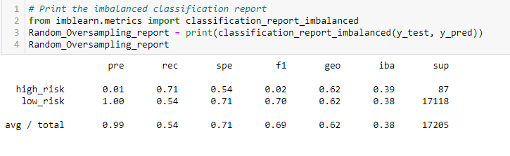
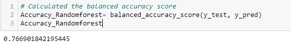

# Credit_Risk_Analysis
Supervised_Machine Learning

Overview of the analysis: 

Credit risk is an inherently unbalanced classification problem, as good loans easily outnumber risky loans. Therefore, you’ll need to employ different techniques to train and evaluate models with unbalanced classes,using the credit dataset from LendingClub, a peer-to-peer lending services company.

I have analysed the data converted into a dataframe from csv file using pandas jupyter notebook ,I have used the following machine learning libraries to complete this analysis “RandomOverSampler”, “SMOTE”,SMOTEENN algorithms,“ClusterCentroids”,BalancedRandomForestClassifier ,EasyEnsembleClassifier algorithm to perform Oversampling ,under sampling,and combination sampling of the data. 

Results: 
 
Accuracy is the number of correct predictions over the output size. It is an incredibly straightforward measurement, However it does not show a full picture.Precision talks about how precise/accurate your model is out of those predicted positive, how many of them are actual positive.Recall score actually calculates how many of the Actual Positives our model capture through labeling it as Positive (True Positive)

F1 Score might be a better measure to use if we need to seek a balance between Precision and Recall and there is an uneven class distribution, In our analysis F1 score closer to one will be ideal, as we want to reduce mislabeling low risk customers as highrisk and vice versa.

1.In the first 4 models (Random Oversampling, SMOTE, under sampling & combination) the accuracy score is 0.62 and the F1 score for low risk is 0.70 ,f1 score for high risk is 0.02, we want the model to predict the high risk loans with more accuracy as well, Both are not very high so I could not recommend these models.

2.In our analysis F1 score is important, because F1-score is used when the False Negatives and False Positives are crucial. we do not want our model to have high false negatives and False positives , For example we are trying to predict risk if we grant loan to certain customers we dont want to reject a loan for a customer who have no credit risk. The accuracy of adaboost model is 0.93 , However the f1 score for high risk is only 0.50 ,adaboost shows a f1 score of 1 for low risk cases this model is better than the rest of the models ,however not ideal.

Summary: 

All models will generate some false negatives, some false positives, and possibly both. While you can tune a model to minimize one or the other, you often face a tradeoff, where a decrease in false negatives leads to an increase in false positives, or vice versa. You’ll need to optimize for the performance metrics that are most useful for your specific problem.A good F1 score means that you have low false positives and low false negatives, so you’re correctly identifying real threats and you are not disturbed by false alarms.An F1 score is considered perfect when it’s 1 or closer to 1.

My recommendation to improve the adaboost model is resampling and try to improve the f1 score with a more balanced data.Random resampling provides a naive technique for rebalancing the class distribution for an imbalanced dataset.
