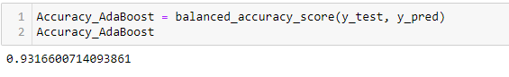
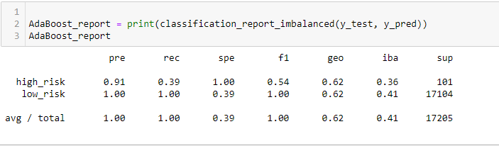

# Credit_Risk_Analysis
Supervised_Machine Learning

Overview of the analysis: 

Credit risk is an inherently unbalanced classification problem, as good loans easily outnumber risky loans. Therefore, you’ll need to employ different techniques to train and evaluate models with unbalanced classes. Using the credit card credit dataset from LendingClub, a peer-to-peer lending services company.

I have analysed the data converted into a dataframe from csv file using pandas jupyter notebook ,I have used the following machine learning libraries “RandomOverSampler” “SMOTE” ,SMOTEENN algorithms,“ClusterCentroids”,BalancedRandomForestClassifier ,EasyEnsembleClassifier algorithm to performe Oversampling ,under sampling,and combination sampling of the data. 

Random resampling provides a naive technique for rebalancing the class distribution for an imbalanced dataset.
Random oversampling duplicates examples from the minority class in the training dataset and can result in overfitting for some models.
Random undersampling deletes examples from the majority class and can result in losing information invaluable to a model.

Results: 
 
Methods used:

Precision – Accuracy of positive predictions. Precision tells us how many of the correctly predicted cases actually turned out to be a good call. Example if the model predicted a low-risk loan and truly it is a low-risk loan and we granted the loan, the customer pays back regularly without any delay or default, then we took the right decision based on the model.

Recall tells us what percent of the positive cases did you catch? F1 score tells us what percent of positive predictions were correct. F1-score is a harmonic mean of Precision and Recall, and so it gives a combined idea about these two metrics. It is maximum when Precision is equal to Recall.

A Classification report is used to measure the quality of predictions from a classification algorithm. How many predictions are True and how many are False? More specifically, True Positives, False Positives, True negatives and False Negatives are used to predict the metrics of a classification report as shown below.

From the images below , 

1.The balanced accuracy scores

2.The precision, recall and F1 scores

Summary: 

all models will generate some false negatives, some false positives, and possibly both. While you can tune a model to minimize one or the other, you often face a tradeoff, where a decrease in false negatives leads to an increase in false positives, or vice versa. You’ll need to optimize for the performance metrics that are most useful for your specific problem.A good F1 score means that you have low false positives and low false negatives, so you’re correctly identifying real threats and you are not disturbed by false alarms.An F1 score is considered perfect when it’s 1 or closer to 1.

For the ensemble classifiers, the easy ensemble adaboost performed better than the balanced random forest classifier with an accuracy score of 0.93 and an F1 score of 0.16. The balanced random forest has an accuracy score of 0.75 and an F1 score of 0.05, making adaboost the obvious winner.

Summarize the results of the machine learning models, and include a recommendation on the model to use, if any. If you do not recommend any of the models, justify your reasoning.
